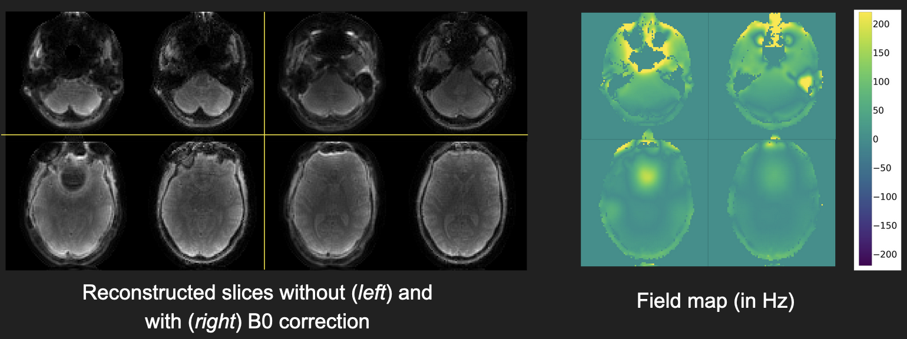

Acquisition and reconstruction of 3D stack-of-spirals data

# sosp3d package

The folder `sosp3d` contains Python code to acquire (work in progress) 
and reconstruct 3D stack-of-spirals data. The steps to set up a Python environment
and install the necessary Python packages are detailed in the README file of
the `sosp3d/` folder. The reconstruction code
requires
* k-space data
* k-space locations of acquired spiral trajectories
* sensitivity maps
* B0 maps (optional; needed for off-resonance correction)

The above data can be provided in the form of separate h5 files or PyTorch tensors 
directly. The format of the necessary h5 files or tensors are given
in `sosp3d/recon/recon3dsosp.py`.

# Installation

Clone this git repo locally using `git clone`. 
Set up a Python environment on your system.
Instructions to set up a [Conda](https://docs.conda.io/en/latest/)
environment for Python, are detailed in `sosp3d/README.md`. 
Follow the instructions in `sosp3d/README.md` and set up a 
separate Conda environment for this project 
(and name it something relevant like `sosp3d_env`).
For users who already have their k-space data, trajectory data,
sensitivity maps etc. in the form of h5 files, you can move on to the 
next step (Usage).

For users that are starting out with P-files and .mod files for data
acquired on GE scanners, we also provide some MATLAB code in the `GE/` folder
to generate the 
h5 files required for reconstruction. `GE/README.md`
contains instructions to install the MATLAB toolboxes necessary to 
read in GE data. We hope to include similar steps for other vendors in
the future (for e.g., Siemens).

# Usage

Once the Python environment is set up, the next step is to get the data
ready for reconstruction. An example script is given in `examples/reconGEdata.py`.
The recon code expects the following h5
files (*the files themselves can be arbitrarily named, but the
datasets within them have to be named as given below*):

1. h5 file containing k-space data, with 2 datasets called `/kdata_r` and `/kdata_i` 
each of size `[(nbatch), ncoil, nshot, nread]`,
representing the real and imaginary parts of the k-space data

2. h5 file containing spiral trajectories (in radians), 
with a dataset called `/ktraj`,
of size `[(nbatch), 3, nshot, nread]`

3. h5 file with 2 datasets called `/smaps_r` and `/smaps_i` each of
size `[(nbatch), ncoil, nx, ny, nz]`, containing the real and imaginary
parts of the sensitivity maps

4. (Optional) h5 file with a dataset called `/b0maps`, of size
`[(nbatch), nx, ny, nz]`, that contains
fieldmaps (in Hz)

Here, `nbatch` = (optional) batch dimension, `ncoil` = number of coils,
`nshot` = number of spiral shots, `nread` = number of samples in each spiral readout,
`nx ny nz` = image matrix size. The `helpers/` folder contains MATLAB code
to estimate sensitivity maps and fieldmaps from separately acquired data. There 
are other packages for fieldmap estimation, for e.g., 
[MRIFieldmaps.jl](https://github.com/MagneticResonanceImaging/MRIFieldmaps.jl) is
a Julia-based package for regularized fieldmap estimation in MRI.

</br>

To run the reconstruction routines, navigate to the folder where this Git repository
is locally cloned. Activate the relevant Conda environment using the command
`conda activate sosp3d_env` (assuming that the user installed a new Conda
environment called `sosp3d_env` as per the Installation instructions above).
Enter the Python environment by running the command `python`. Run the code
below, from the Python commandline (by changing the paths to where
your h5 files reside). Note: Alternatively, you can copy the code below into
a script (say `sosp3d_example.py`) and run it directly from the shell using
`python sosp3d_example.py`.

```python
import torch
from sosp3d.recon import sosp3d_cgsense, setup_recondata

# read in h5 files and create PyTorch tensors 
# Note: paths to be modified by user
kdata, ktraj, smaps, b0maps = setup_recondata("path/to/kdata.h5", "path/to/ktraj.h5",\
"path/to/smaps.h5", "path/to/b0maps.h5", device=torch.device('cuda:0'))

# recon
xrec = sosp3d_cgsense(kdata, ktraj, smaps, b0maps=b0maps, mri_forw_args={'numpoints': (6,6,1), 'L': 36})

```

</br>

To visualize the reconstructed image, use the `im` function from the `sosp3d/` folder and run

```python
from sosp3d.utils import im

im(torch.abs(xrec[0,...,0:-1:4]).squeeze().cpu().numpy(), (3,3), transpose=True, savepath='path/to/xrec.png')
```

</br>
</br>

To play around with the reconstruction code, please reach out to 
Jon-Fredrik Nielsen (jfnielse@umich.edu) or Naveen Murthy (nnmurthy@umich.edu),
and we would be happy to provide a link to a 3D stack-of-spirals dataset acquired on our GE 3T scanner
at University of Michigan. Reconstruction results (with and without off-resonance correction)
are shown below for 4 slices; using the example script in `examples/reconGEdata.py`.
</br>
</br>

</br>
</br>


# Acknowledgements

If this code is useful for your research, please cite:

```
@inproceedings{wang:22:mirtorch,
  title={{MIRTorch}: A {PyTorch}-powered Differentiable Toolbox for Fast Image Reconstruction and Scan Protocol Optimization},
  author={Wang, Guanhua and Shah, Neel and Zhu, Keyue and Noll, Douglas C. and Fessler, Jeffrey A.},
  booktitle={Proc. Intl. Soc. Magn. Reson. Med. (ISMRM)},
  pages={4982},
  year={2022}
}
```
```
@ARTICLE{fessler:05:tbi,
 author = {J. A. Fessler and S. Lee and V. T. Olafsson and H. R. Shi and D. C. Noll},
 title = {Toeplitz-based iterative image reconstruction for {MRI} with correction for magnetic field inhomogeneity},
 journal = {{IEEE Trans. Sig. Proc.}},
 volume = 53,
 number = 9,
 pages = {{3393--402}},
 month = sep,
 doi = {10.1109/TSP.2005.853152},
 year = 2005
}
```


